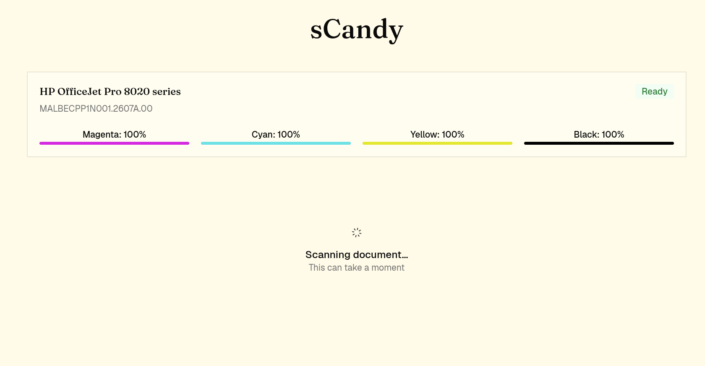
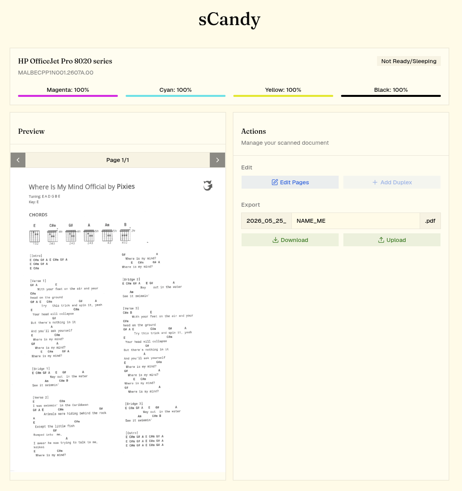
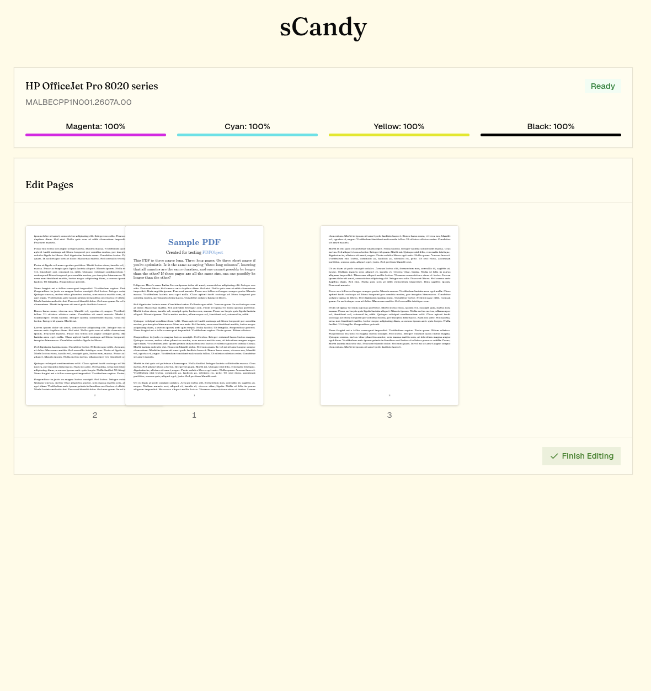

# sCandy — Scanner App

A Next.js web app for scanning documents, editing PDFs, and uploading them to Nextcloud.

> Waiting for a scan to finish


> Results page


> Edit page


## Running with Docker

### 1. Pull the image

```bash
docker pull ghcr.io/mariuuus/scandy:latest
```

### 2. Configure environment

Copy `example.env` and fill in your values:

```bash
cp example.env .env
```

| Variable           | Description                              |
|--------------------|------------------------------------------|
| `PRINTER_IP_ADRESSE` | IP address of your network scanner/printer |
| `PRINTER_URL`      | Base URL of the printer (auto-set from IP) |
| `NEXTCLOUD_HOST`   | Hostname or IP of your Nextcloud instance |
| `NEXTCLOUD_USER`   | Nextcloud username                       |
| `NEXTCLOUD_PASS`   | Nextcloud password                       |
| `NEXTCLOUD_FOLDER` | Target folder for uploaded scans         |

### 3. Run the container

```bash
docker run -d \
  --name scandy \
  --env-file .env \
  -p 3000:3000 \
  ghcr.io/mariuuus/scandy:latest
```

Open [http://localhost:3000](http://localhost:3000) in your browser.

### Docker Compose example

```yaml
services:
  scandy:
    image: ghcr.io/mariuuus/scandy:latest
    restart: unless-stopped
    ports:
      - "3000:3000"
    env_file:
      - .env
```

```bash
docker compose up -d
```

## Building the image locally

```bash
docker build -t scandy .
docker run -d --env-file .env -p 3000:3000 scandy
```

## Publishing a new release

Trigger the **"Build and publish Docker image"** workflow manually from the GitHub Actions tab.
Enter the desired version (e.g. `1.2.0`) — the workflow tags the image with both that version and `latest`.
